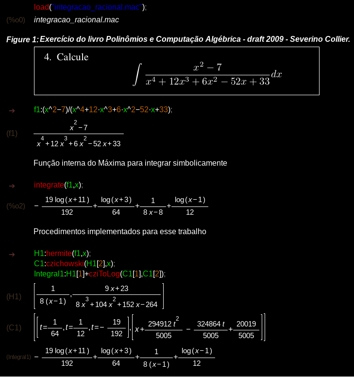

# Integração Simbólica de Funções Racionais

O presente projeto implementa dois algoritmos para a integração simbólica de funções racionais.

- Algoritmo de *Hermite*
- Algoritmo de *czichowski*

no lendário sistema de computação algébrica **Máxima** - desenvolvido em *LISP* no final da década de 60
pelo *MIT*.

**Definição.** Uma função racional é aquela que pode ser escrita como uma razão entre polinômios. Ex:

$$
  \frac{x^2+2}{x^4+4x^3+5x^2+4x+4}
$$

> Um algoritmo simbólico de integração é aquele que determina uma **expressão analítica para a primitiva** da função do integrando, ao invés de calcular
o **valor numérico da integral definida** em um intervalo.

O método mais antigo que se conhece para integração de funções racionais é o algoritmo de
**frações parciais**, desenvolvido por **Johann Bernoulli** no século XVIII. Tal método pode ser 
implementado no computador, porém oferece baixa eficiência computacional, uma vez que o polinômio do denonimador
precisa ser completamente fatorado para funcionar - algo que custa caro computacionalmente.

Sendo assim, o projeto em questão traz:

- Slides para a apresentação teórica de ambos os algoritmos.
- o código `integracao_racional.mac`, contendo a implementação de ambos os algoritmos.
- um *Notebook* contendo a aplicação e comparação dos procedimentos implementados com a função nativa do **Máxima** para integração simbólica de funções.

Para ilustrar o funcionamento:

Note que o resultado da função *integrate* do **Máxima** confere com o resultado de *Integral1*, que combina os resultados de *Hermite* com o *cziToLog* aplicado
ao *czichowski*. 
